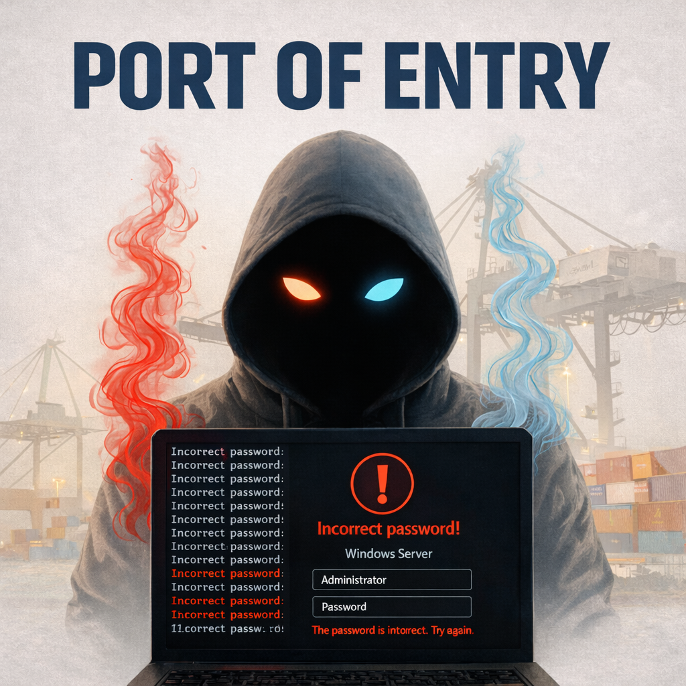

<h1 align="center">Threat Hunting Scenario – Port of Entry</h1>

  Threat hunting investigation using Microsoft Defender for Endpoint to reconstruct a multi-stage attack involving RDP compromise, malware staging, defense evasion, persistence, credential dumping, data exfiltration, and lateral movement.

  
  
  
  

  <picture>
    <!-- Dark mode -->
    <source media="(prefers-color-scheme: dark)" srcset="assets/port-of-entry-banner-dark.png" alt="Threat Hunting Scenario – Port of Entry Banner" width="650">
    <!-- Light mode -->
    <source media="(prefers-color-scheme: light)" srcset="assets/port-of-entry-banner-light.png" alt="Threat Hunting Scenario – Port of Entry Banner" width="650">
    <!-- Light mode fallback -->
    
  </picture>

---

## Overview

This project documents a threat hunting investigation conducted within Microsoft Defender for Endpoint Advanced Hunting.

The investigation analyzes suspicious activity involving a workstation belonging to **Azuki Import/Export Trading Co.**, where the organization suspected a compromise after a competitor began undercutting their shipping contracts.

Using endpoint telemetry and KQL queries, the investigation reconstructs the attacker’s activity from **initial access to lateral movement**.

---

## Environment

| Component | Description |
|---|---|
| Security Platform | Microsoft Defender for Endpoint |
| Query Language | Kusto Query Language (KQL) |
| Endpoint | AZUKI-SL workstation |
| Timeframe | Nov 19–20 |
| Investigation Type | Threat Hunt |

---

## Skills Demonstrated

- Threat hunting with Microsoft Defender for Endpoint
- Advanced hunting using KQL
- Endpoint telemetry analysis
- Attack chain reconstruction
- MITRE ATT&CK mapping
- Detection engineering recommendations
- Security incident reporting

---

## Key Findings

| Stage | Finding |
|---|---|
| Initial Access | RDP login from external IP **88.97.178.12** |
| Compromised User | **kenji.sato** |
| Discovery | Network reconnaissance using `arp -a` |
| Malware Staging | Files stored in `C:\ProgramData\WindowsCache` |
| Defense Evasion | Windows Defender exclusions added |
| Persistence | Scheduled task **Windows Update Check** |
| Command & Control | Connection to **78.141.196.6:443** |
| Credential Access | Credential dumping via **mm.exe** |
| Collection | Sensitive files compressed into **export-data.zip** |
| Exfiltration | Data sent via **Discord** |
| Anti-Forensics | Event logs tampered with |
| Lateral Movement | Attempted RDP using `mstsc.exe` |

---

## MITRE ATT&CK Mapping

| Tactic | Technique |
|---|---|
| Initial Access | Remote Services (RDP) |
| Discovery | System Network Configuration Discovery |
| Defense Evasion | Impair Defenses |
| Persistence | Scheduled Task |
| Command & Control | Application Layer Protocol |
| Credential Access | OS Credential Dumping |
| Collection | Archive Collected Data |
| Exfiltration | Exfiltration Over Web Service |
| Defense Evasion | Clear Windows Event Logs |
| Lateral Movement | Remote Services |

---

## Investigation Report

Full investigation details are available here:

`investigation/port-of-entry-threat-hunt-report.md`

---

## Repository Contents

| Folder | Description |
|---|---|
| investigation | Full threat hunting report |
| queries | KQL queries used during investigation |
| evidence | Screenshots and artifacts |
| assets | Repository banner and images |

---

## Author

**Sun Dimitri NFANDA**

Cybersecurity Analyst Portfolio  
