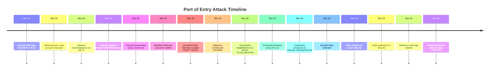

<h1 align="center">
  Port of Entry Threat Hunt Report
</h1>

## Executive Summary

A threat hunting investigation was conducted using Microsoft Defender for Endpoint Advanced Hunting after Azuki Import/Export Trading Co. suspected a compromise of a workstation belonging to an IT administrator.

Analysis of endpoint telemetry revealed a multi-stage intrusion beginning with unauthorized RDP access from an external IP address. The attacker performed reconnaissance, staged malicious tools, modified Windows Defender protections, established persistence through scheduled tasks, communicated with a command-and-control server, dumped credentials, collected sensitive data, and exfiltrated it through a public web service.

The attacker later attempted to remove evidence by clearing Windows event logs and initiating lateral movement.

This report documents the investigation process and maps each discovery to corresponding evidence.

---

## Scenario Background

Azuki Import/Export Trading Co. is a logistics company operating across Japan and Southeast Asia.

Recently, the company discovered that a competitor began consistently undercutting their shipping contract bids.

Management suspected that sensitive pricing and supplier information had been stolen and requested a threat hunt to determine whether a compromise had occurred.

The investigation focused on an IT administrator workstation: `AZUKI-SL`.

Telemetry from Microsoft Defender for Endpoint was analyzed to reconstruct attacker activity.

---

## Hunt Objectives

The goals of this investigation were to:

• Identify the initial compromise vector  
• Determine the compromised account  
• Track attacker activity across the endpoint  
• Identify persistence mechanisms  
• Detect command-and-control communication  
• Identify credential access techniques  
• Determine whether sensitive data was collected  
• Detect potential exfiltration activity  
• Identify anti-forensics attempts  
• Detect lateral movement attempts  

---

## Scope & Environment

| Component | Description |
|---|---|
| Security Platform | Microsoft Defender for Endpoint |
| Query Language | Kusto Query Language (KQL) |
| Endpoint | `AZUKI-SL` |
| Investigation Window | Nov 19 – Nov 20 |
| Investigation Type | Threat Hunt |

---

## Attack Timeline

| Stage | Activity |
|------|------|
| Initial Access | External RDP login from `88.97.178.12` |
| Discovery | Network enumeration using `arp -a` |
| Malware Staging | Files created in `C:\ProgramData\WindowsCache` |
| Defense Evasion | Windows Defender exclusions added |
| Persistence | Scheduled task `Windows Update Check` created |
| Command & Control | Connection to `78.141.196.6:443` |
| Credential Access | Credentials dumped using `mm.exe` |
| Collection | Sensitive files archived |
| Exfiltration | Data uploaded via Discord |
| Anti-Forensics | Windows event logs cleared |
| Lateral Movement | RDP attempt via `mstsc.exe` |

---

## Attack Timeline Diagram

---

## Investigation Findings

---

### 🚩 Flag 1 — Initial Access Source IP

**Question**

What external IP initiated the RDP login?

**KQL Query**

    DeviceLogonEvents
    | where LogonType == "RemoteInteractive"
    | where DeviceName == "AZUKI-SL"
    | project Timestamp, AccountName, RemoteIP

**Answer**

`88.97.178.12`

**Analysis**

The query identified an external IP initiating a remote interactive logon session on the workstation.

**Evidence**

---

### 🚩 Flag 2 — Compromised Account

**Question**

Which account authenticated during the intrusion?

**KQL Query**

    DeviceLogonEvents
    | where RemoteIP == "88.97.178.12"
    | project Timestamp, AccountName

**Answer**

`kenji.sato`

**Analysis**

The login event shows authentication using this account.

**Evidence**

---

### 🚩 Flag 3 — Network Recon Command

**Question**

What command was used to enumerate network neighbors?

**KQL Query**

    DeviceProcessEvents
    | where ProcessCommandLine contains "arp"

**Answer**

`arp -a`

**Analysis**

The command lists nearby hosts and is commonly used during reconnaissance.

**Evidence**

---

### 🚩 Flag 4 — Malware Staging Directory

**Question**

Where were attacker tools stored?

**KQL Query**

    DeviceFileEvents
    | where FolderPath contains "ProgramData"

**Answer**

`C:\ProgramData\WindowsCache`

**Analysis**

This directory was used as a staging location for malicious tools.

**Evidence**

---

### 🚩 Flag 5 — Malware Download Tool

**Question**

Which tool downloaded malicious payloads?

**KQL Query**

    DeviceProcessEvents
    | where ProcessCommandLine contains "certutil"

**Answer**

`certutil.exe`

**Analysis**

`certutil` is a legitimate Windows utility often abused to download remote payloads.

**Evidence**

---

### 🚩 Flag 6 — Defender Evasion

**Question**

What defense mechanism was modified?

**KQL Query**

    DeviceRegistryEvents
    | where RegistryKey contains "Windows Defender"

**Answer**

Windows Defender exclusions were added.

**Analysis**

Exclusions allow malicious files to bypass scanning.

**Evidence**

---

### 🚩 Flag 7 — Persistence Mechanism

**Question**

How did the attacker maintain persistence?

**KQL Query**

    DeviceProcessEvents
    | where ProcessCommandLine contains "schtasks"

**Answer**

A scheduled task was created.

**Analysis**

Scheduled tasks allow malware to execute automatically.

**Evidence**

---

### 🚩 Flag 8 — Scheduled Task Name

**Answer**

`Windows Update Check`

**Evidence**

---

### 🚩 Flag 9 — Persistence Binary

**Answer**

`svchost.exe`

**Evidence**

---

### 🚩 Flag 10 — Command and Control Server

**Question**

Which IP served as the C2 server?

**KQL Query**

    DeviceNetworkEvents
    | where RemoteIP == "78.141.196.6"

**Answer**

`78.141.196.6`

**Evidence**

---

### 🚩 Flag 11 — C2 Port

**Answer**

`443`

---

### 🚩 Flag 12 — Credential Dump Tool

**Answer**

`mm.exe`

---

### 🚩 Flag 13 — Credential Dump Command

**Answer**

`sekurlsa::logonpasswords`

---

### 🚩 Flag 14 — Data Collection Activity

Sensitive files were gathered prior to archiving.

---

### 🚩 Flag 15 — Archive File

**Answer**

`export-data.zip`

---

### 🚩 Flag 16 — Exfiltration Channel

**Answer**

`Discord`

---

### 🚩 Flag 17 — Exfiltration Destination

Data was uploaded to a Discord endpoint.

---

### 🚩 Flag 18 — Anti-Forensics

Windows event logs were cleared.

---

### 🚩 Flag 19 — Lateral Movement Tool

**Answer**

`mstsc.exe`

---

### 🚩 Flag 20 — Impact

Sensitive company data was successfully exfiltrated.

---

## MITRE ATT&CK Mapping

| Tactic | Technique |
|---|---|
| Initial Access | T1021 – Remote Services |
| Discovery | T1049 – System Network Discovery |
| Defense Evasion | T1562 – Impair Defenses |
| Persistence | T1053 – Scheduled Task |
| Command & Control | T1071 – Application Layer Protocol |
| Credential Access | T1003 – OS Credential Dumping |
| Collection | T1560 – Archive Collected Data |
| Exfiltration | T1567 – Exfiltration Over Web Service |
| Defense Evasion | T1070 – Clear Windows Event Logs |
| Lateral Movement | T1021 – Remote Services |

---

## Detection Opportunities

Security monitoring improvements include:

• Detect external RDP logins from unknown IP addresses  
• Monitor Defender configuration changes  
• Alert on suspicious scheduled tasks executing binaries from `ProgramData`  
• Detect credential dumping activity  
• Monitor unusual outbound connections to platforms such as Discord  

---

## Conclusion

The investigation confirmed that the `AZUKI-SL` workstation was compromised through unauthorized RDP access.

The attacker successfully conducted reconnaissance, staged malware, established persistence, harvested credentials, exfiltrated sensitive company information, and attempted to erase traces of the intrusion.

Improved monitoring of authentication events, endpoint protection changes, and suspicious outbound network traffic would significantly improve detection capabilities.

---

## Author

Sun Dimitri NFANDA  
Cybersecurity Analyst Portfolio
